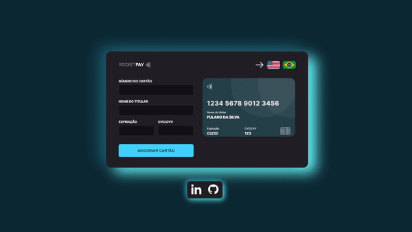
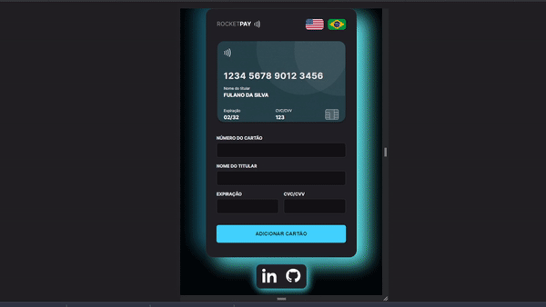

<h1 align="center"> Explorer Lab #01 </h1>

Evento exclusivo que participei no ano de 2022, promovido pela Rocketseat para ensino de tecnologias Front-end e Back-end.

  <a href="#-tecnologias">Tecnologias</a>&nbsp;&nbsp;&nbsp;|&nbsp;&nbsp;&nbsp;
  <a href="#-projeto">Projeto</a>&nbsp;&nbsp;&nbsp;

 

<a href="https://rocketseat-creditcard.vercel.app/"  target="_blank">Acesse aqui a aplicação</a>

  

 

  

  

## 🚀 Tecnologias

Esse projeto foi desenvolvido com as seguintes tecnologias:

- HTML e CSS
- JavaScript e JSON
- [Node e NPM](https://nodejs.org/)
- [Vite](https://vitejs.dev/)
- [iMask](https://imask.js.org)

## 💻 Projeto

O Rocketpay é um componente que simula o formulário de preenchimento de cartão de crédito, onde é possível adicionar máscara aos inputs e atualizar elementos HTML via DOM.

O projeto retorna imagens e ícones personalizados conforme a bandeira do cartão de crédito selecionada.

## 💡 Features by Marco

- Tradução de Inglês para Português, e de Português para Inglês.
- Máscara de caracteres que não permite números no campo de Nome.
- Ícones e SVG coloridos.
- Coluna lateral com links para Portfolio, GitHub, e LinkedIn.
- Validações com feedback.
- Modal de feedback para cartão adicionado.

---

Feito com ♥ por Marco :wave: [Acesse meu perfil no LinkedIn](https://www.linkedin.com/in/marco-antonio-faquim-3645ab194/)

<a href="https://www.linkedin.com/in/marco-antonio-faquim-3645ab194/" target="_blank">

  

</a>
